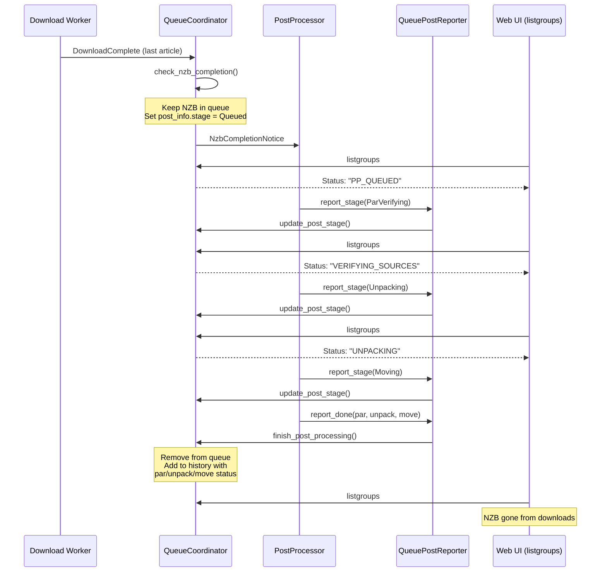

# Post-Processing Pipeline

## Pipeline Overview

After a download completes, bergamot runs a multi-stage post-processing pipeline to verify, repair, unpack, and organize the downloaded files.

```
Download Complete
       │
       ▼
  Par Rename ──── rename obfuscated files using PAR2 hashes
       │
       ▼
  PAR2 Verify ─── check file integrity via CRC/block verification
       │
   ┌───┴───┐
   │       │
   OK    Damaged
          │
       Repair ──── reconstruct missing/damaged blocks
          │
       Verify ──── re-verify repaired files
   │       │
   └───┬───┘
       ▼
  RAR Rename ──── rename obfuscated archives using RAR headers
       │
       ▼
    Unpack ─────── extract RAR/7z/ZIP/split archives
       │
       ▼
   Cleanup ─────── remove archive files and unwanted extensions
       │
       ▼
     Move ──────── move files from InterDir to DestDir
       │
       ▼
  Extensions ───── run post-processing extension scripts
       │
       ▼
   History ─────── record final status in history
```

## PostStage Enum

Each stage of the pipeline is tracked so progress can be reported to the UI:

```rust
#[derive(Debug, Clone, Copy, PartialEq, Eq)]
pub enum PostStage {
    Queued,
    Loading,         // loading NZB metadata
    ParRenaming,     // renaming files using PAR2 hashes
    ParVerifying,    // PAR2 quick or full verification
    ParRepairing,    // reconstructing damaged blocks
    RarRenaming,     // renaming obfuscated RAR files
    Unpacking,       // extracting archives
    Cleanup,         // removing archive files
    Moving,          // moving files to final destination
    Extensions,      // running extension scripts
    Finished,
}
```

## PostProcessor Struct

The `PostProcessor` runs in its own task, receiving completed downloads via a channel:

```rust
use tokio::sync::mpsc;

pub struct PostProcessRequest {
    pub nzb_id: i64,
    pub nzb_name: String,
    pub working_dir: PathBuf,
    pub category: Option<String>,
    pub parameters: Vec<(String, String)>,
    pub par_status: ParStatus,
    pub unpack_status: UnpackStatus,
}

pub struct PostProcessor {
    rx: mpsc::Receiver<PostProcessRequest>,
    config: Arc<Config>,
    history: Arc<Mutex<HistoryManager>>,
}

impl PostProcessor {
    pub fn new(
        rx: mpsc::Receiver<PostProcessRequest>,
        config: Arc<Config>,
        history: Arc<Mutex<HistoryManager>>,
    ) -> Self {
        Self { rx, config, history }
    }

    pub async fn run(&mut self) {
        while let Some(request) = self.rx.recv().await {
            self.process(request).await;
        }
    }

    async fn process(&self, req: PostProcessRequest) {
        let mut ctx = PostProcessContext::new(&req, &self.config);

        ctx.set_stage(PostStage::ParRenaming);
        self.par_rename(&mut ctx).await;

        ctx.set_stage(PostStage::ParVerifying);
        self.par_verify(&mut ctx).await;

        if ctx.par_status == ParStatus::Damaged {
            ctx.set_stage(PostStage::ParRepairing);
            self.par_repair(&mut ctx).await;
        }

        ctx.set_stage(PostStage::RarRenaming);
        self.rar_rename(&mut ctx).await;

        ctx.set_stage(PostStage::Unpacking);
        self.unpack(&mut ctx).await;

        ctx.set_stage(PostStage::Cleanup);
        self.cleanup(&mut ctx).await;

        ctx.set_stage(PostStage::Moving);
        self.move_files(&mut ctx).await;

        ctx.set_stage(PostStage::Extensions);
        self.run_extensions(&mut ctx).await;

        ctx.set_stage(PostStage::Finished);
        self.finalize(&mut ctx).await;
    }
}
```

## Status Reporting Flow

When a download completes, the NZB stays in the download queue while
post-processing runs. The `PostProcessor` reports each stage back to the
`QueueCoordinator` via a `PostStatusReporter` trait, and the web UI sees
the current PP status through `listgroups`.



### Key Components

- **`PostStatusReporter` trait** (`crates/bergamot-postproc/src/processor.rs`):
  Defines `report_stage()` and `report_done()` so the post-processor can
  report progress without depending on the queue crate.
- **`QueuePostReporter`** (`crates/bergamot/src/app.rs`):
  Implements the trait by forwarding calls to `QueueHandle`, bridging the
  two crates without a circular dependency.
- **`QueueCoordinator`** (`crates/bergamot-queue/src/coordinator.rs`):
  Stores `post_info` on the NZB while PP is active. `finish_post_processing()`
  removes the NZB from the queue and creates a history entry with final statuses.
- **`rpc_listgroups`** (`crates/bergamot-server/src/rpc.rs`):
  Maps `post_info.stage` to status strings (PP_QUEUED, VERIFYING_SOURCES,
  UNPACKING, MOVING, etc.) that the web UI already understands.

### Status String Mapping

| PostStage      | listgroups Status    | Web UI Label   |
|----------------|----------------------|----------------|
| Queued         | PP_QUEUED            | PP-QUEUED      |
| ParLoading     | LOADING_PARS         | CHECKING       |
| ParRenaming    | RENAMING             | RENAMING       |
| ParVerifying   | VERIFYING_SOURCES    | CHECKING       |
| ParRepairing   | REPAIRING            | REPAIRING      |
| Unpacking      | UNPACKING            | UNPACKING      |
| Moving         | MOVING               | MOVING         |
| Executing      | EXECUTING_SCRIPT     | PROCESSING     |
| Finished       | PP_FINISHED          | FINISHED       |

## PostStrategy

Controls how aggressively post-processing runs relative to downloading:

```rust
#[derive(Debug, Clone, Copy, PartialEq, Eq)]
pub enum PostStrategy {
    /// One post-processing job at a time, pauses download during PAR repair
    Sequential,
    /// One post-processing job at a time, download continues during PAR repair
    Balanced,
    /// Multiple post-processing jobs in parallel, download continues
    Rocket,
    /// Like Rocket but also starts post-processing before download completes
    Aggressive,
}
```

- **Sequential**: safest option, minimizes disk I/O contention.
- **Balanced**: default, keeps the download pipeline busy during repairs.
- **Rocket**: best for fast connections with SSD storage.
- **Aggressive**: enables direct unpack (see below).

## PAR2 System

### What PAR2 Is

PAR2 (Parity Archive Volume 2) uses Reed-Solomon error correction codes to detect and repair damaged or missing files. A PAR2 set contains:

- **Main PAR2 file** (`name.par2`): contains file descriptions, checksums (MD5, CRC32), and block hashes for verification. No recovery data.
- **Recovery volumes** (`name.vol000+01.par2`, `name.vol001+02.par2`, ...): contain recovery blocks that can reconstruct missing data. The `+NN` indicates how many recovery blocks the volume contains.

The number of recovery blocks needed equals the number of missing or damaged blocks. If a download is missing 3 blocks, 3 recovery blocks from any combination of recovery volumes are sufficient to repair.

### Verification Flow

```
Load main .par2 file
        │
        ▼
  Quick verify ─── compare article CRCs against PAR2 file checksums
        │
   ┌────┴────┐
   │         │
All match   Mismatch or CRCs unavailable
   │         │
   │    Full block verification ── read each file, compute MD5 per block
   │         │
   │    ┌────┴────┐
   │    │         │
   │   OK      Need N repair blocks
   │    │         │
   │    │    Load recovery .par2 volumes
   │    │    (unpause from queue if needed)
   │    │         │
   │    │    Enough blocks? ──No──→ Failure
   │    │         │
   │    │        Yes
   │    │         │
   │    │      Repair
   │    │         │
   │    │    Re-verify repaired files
   │    │         │
   └────┴─────────┘
        │
        ▼
    Continue pipeline
```

### Quick Verification Using Article CRCs

During download, the NNTP server provides a CRC32 for each article. bergamot stores these CRCs alongside the decoded file segments. During quick verification, these stored CRCs are compared against the CRC32 values in the PAR2 file's block checksums — if every block's CRC matches, the file is known good without reading the data back from disk:

```rust
pub struct QuickVerifyResult {
    pub verified_files: Vec<PathBuf>,
    pub damaged_files: Vec<PathBuf>,
    pub missing_files: Vec<PathBuf>,
}

fn quick_verify(
    par2_info: &Par2FileInfo,
    article_crcs: &HashMap<PathBuf, Vec<u32>>,
) -> QuickVerifyResult {
    let mut result = QuickVerifyResult::default();

    for file_desc in &par2_info.files {
        match article_crcs.get(&file_desc.filename) {
            None => result.missing_files.push(file_desc.filename.clone()),
            Some(crcs) => {
                let all_match = file_desc
                    .block_checksums
                    .iter()
                    .zip(crcs.iter())
                    .all(|(expected, actual)| expected.crc32 == *actual);

                if all_match {
                    result.verified_files.push(file_desc.filename.clone());
                } else {
                    result.damaged_files.push(file_desc.filename.clone());
                }
            }
        }
    }

    result
}
```

### Requesting More PAR2 Files

Recovery volumes are typically paused in the download queue (nzbget convention: only the main `.par2` file downloads automatically). When repair needs more blocks:

```rust
async fn request_par2_volumes(
    &self,
    ctx: &mut PostProcessContext,
    blocks_needed: usize,
    queue: &Arc<Mutex<DownloadQueue>>,
) -> Result<(), PostProcessError> {
    let mut blocks_available = 0;
    let mut volumes_to_unpause = Vec::new();

    let mut q = queue.lock().await;
    for file_entry in q.files_for_nzb(ctx.nzb_id) {
        if file_entry.is_par2_recovery() && file_entry.is_paused() {
            volumes_to_unpause.push(file_entry.id);
            blocks_available += file_entry.par2_block_count();
            if blocks_available >= blocks_needed {
                break;
            }
        }
    }

    if blocks_available < blocks_needed {
        return Err(PostProcessError::InsufficientParBlocks {
            needed: blocks_needed,
            available: blocks_available,
        });
    }

    for file_id in &volumes_to_unpause {
        q.unpause_file(*file_id);
    }
    drop(q);

    // Wait for the unpaused volumes to finish downloading
    ctx.wait_for_files(&volumes_to_unpause).await?;

    Ok(())
}
```

### PAR2 Library Options

| Approach | Pros | Cons |
|----------|------|------|
| Shell out to `par2` command | Simple, well-tested, widely available | Process overhead, output parsing |
| `par2` crate | Pure Rust, no external dependency | Maturity, feature completeness |
| FFI to `libpar2` | Fast, full-featured | Build complexity, unsafe code |
| Native implementation | Full control, integrated progress | Significant effort |

**Recommendation**: start by shelling out to the `par2` command-line tool (`par2cmdline` or `par2cmdline-turbo`). This is proven, handles edge cases, and allows focusing development effort elsewhere. Wrap it behind a trait so the implementation can be swapped later:

```rust
#[async_trait]
pub trait Par2Engine: Send + Sync {
    async fn verify(&self, par2_file: &Path, working_dir: &Path) -> Result<Par2Result, Par2Error>;
    async fn repair(&self, par2_file: &Path, working_dir: &Path) -> Result<Par2Result, Par2Error>;
}

pub struct Par2CommandLine {
    par2_path: PathBuf, // path to par2 binary
}

#[async_trait]
impl Par2Engine for Par2CommandLine {
    async fn verify(&self, par2_file: &Path, working_dir: &Path) -> Result<Par2Result, Par2Error> {
        let output = tokio::process::Command::new(&self.par2_path)
            .arg("verify")
            .arg(par2_file)
            .current_dir(working_dir)
            .output()
            .await?;

        parse_par2_output(&output)
    }

    async fn repair(&self, par2_file: &Path, working_dir: &Path) -> Result<Par2Result, Par2Error> {
        let output = tokio::process::Command::new(&self.par2_path)
            .arg("repair")
            .arg(par2_file)
            .current_dir(working_dir)
            .output()
            .await?;

        parse_par2_output(&output)
    }
}

#[derive(Debug)]
pub enum Par2Result {
    AllFilesOk,
    RepairComplete,
    RepairNeeded { blocks_needed: usize, blocks_available: usize },
    RepairFailed { reason: String },
}
```

## Unpacking

### Supported Formats

- **RAR** archives (`.rar`, `.r00`–`.r99`, multi-part)
- **7-Zip** archives (`.7z`)
- **ZIP** archives (`.zip`)
- **Split files** (`.001`, `.002`, ... — joined before extraction)

### UnpackController

```rust
pub struct UnpackController {
    config: Arc<Config>,
}

impl UnpackController {
    pub async fn unpack(&self, ctx: &mut PostProcessContext) -> Result<UnpackStatus, UnpackError> {
        let archives = self.find_archives(&ctx.working_dir)?;
        if archives.is_empty() {
            return Ok(UnpackStatus::NothingToUnpack);
        }

        let unpack_dir = self.create_unpack_dir(&ctx.working_dir)?;

        // Join split files first (.001 + .002 + ...)
        self.join_splits(&ctx.working_dir, &archives.split_files).await?;

        for archive in &archives.entries {
            match archive.format {
                ArchiveFormat::Rar => {
                    self.unrar(archive, &unpack_dir, ctx).await?;
                }
                ArchiveFormat::SevenZip => {
                    self.un7z(archive, &unpack_dir, ctx).await?;
                }
                ArchiveFormat::Zip => {
                    self.unzip(archive, &unpack_dir, ctx).await?;
                }
            }
        }

        // Move unpacked files back to working dir
        self.flatten_unpack_dir(&unpack_dir, &ctx.working_dir)?;

        Ok(UnpackStatus::Success)
    }

    fn find_archives(&self, dir: &Path) -> Result<ArchiveSet, UnpackError> {
        let mut set = ArchiveSet::default();

        for entry in std::fs::read_dir(dir)? {
            let entry = entry?;
            let path = entry.path();
            let name = path.file_name().unwrap_or_default().to_string_lossy();

            if name.ends_with(".rar") || is_old_rar_naming(&name) {
                if is_first_rar_volume(&name) {
                    set.entries.push(ArchiveEntry {
                        path,
                        format: ArchiveFormat::Rar,
                    });
                }
            } else if name.ends_with(".7z") {
                set.entries.push(ArchiveEntry {
                    path,
                    format: ArchiveFormat::SevenZip,
                });
            } else if name.ends_with(".zip") {
                set.entries.push(ArchiveEntry {
                    path,
                    format: ArchiveFormat::Zip,
                });
            } else if is_split_file(&name) {
                set.split_files.push(path);
            }
        }

        Ok(set)
    }

    fn create_unpack_dir(&self, working_dir: &Path) -> Result<PathBuf, UnpackError> {
        let unpack_dir = working_dir.join("_unpack");
        std::fs::create_dir_all(&unpack_dir)?;
        Ok(unpack_dir)
    }
}
```

### Calling External Unpackers

Archives are extracted by shelling out to `unrar`, `7z`, or `unzip`. Output is parsed to detect errors:

```rust
async fn unrar(
    &self,
    archive: &ArchiveEntry,
    dest: &Path,
    ctx: &mut PostProcessContext,
) -> Result<(), UnpackError> {
    let output = tokio::process::Command::new(&self.config.unrar_cmd)
        .args(["x", "-y", "-p-"])
        .arg(&archive.path)
        .arg(dest)
        .output()
        .await?;

    let stderr = String::from_utf8_lossy(&output.stderr);
    let stdout = String::from_utf8_lossy(&output.stdout);

    if !output.status.success() {
        if stdout.contains("password is incorrect") || stderr.contains("password is incorrect") {
            return Err(UnpackError::PasswordRequired);
        }
        if stdout.contains("No space left on device") || stderr.contains("No space left on device") {
            return Err(UnpackError::DiskFull);
        }
        if stdout.contains("packed data CRC failed") || stderr.contains("packed data CRC failed") {
            return Err(UnpackError::CorruptArchive);
        }
        return Err(UnpackError::CommandFailed {
            exit_code: output.status.code(),
            stderr: stderr.into_owned(),
        });
    }

    Ok(())
}
```

### Direct Unpack

When `PostStrategy::Aggressive` is active and `DirectUnpack` is enabled, unpacking begins while files are still downloading. This works for RAR archives where volumes are downloaded in order:

```rust
pub struct DirectUnpack {
    nzb_id: i64,
    archive_name: String,
    next_volume: usize,
    unpack_dir: PathBuf,
}

impl DirectUnpack {
    /// Called each time a new file finishes downloading.
    /// Returns true if this file was the next expected volume and unpacking progressed.
    pub async fn on_file_complete(
        &mut self,
        file_path: &Path,
        unrar_cmd: &Path,
    ) -> Result<bool, UnpackError> {
        if !self.is_next_volume(file_path) {
            return Ok(false);
        }

        // unrar can extract from a partial set if volumes arrive in order
        let output = tokio::process::Command::new(unrar_cmd)
            .args(["x", "-y", "-p-", "-vp"])
            .arg(file_path)
            .arg(&self.unpack_dir)
            .output()
            .await?;

        if output.status.success() {
            self.next_volume += 1;
        }

        Ok(output.status.success())
    }
}
```

## Password Handling

Passwords for encrypted archives can come from multiple sources, checked in order:

1. **NZB metadata**: `<meta type="password">secret</meta>` in the NZB XML.
2. **Post-processing parameter**: set via API `editqueue` with `PostProcess::Password`.
3. **Password file**: a text file (`PasswordFile` config) with one password per line, tried sequentially.
4. **Indexer format**: password embedded in the NZB filename as `{{password}}` — e.g., `My.Release{{secret}}.nzb`.

```rust
fn extract_passwords(ctx: &PostProcessContext, config: &Config) -> Vec<String> {
    let mut passwords = Vec::new();

    // From NZB metadata
    if let Some(pw) = ctx.nzb_metadata.get("password") {
        passwords.push(pw.clone());
    }

    // From post-processing parameter
    if let Some(pw) = ctx.parameters.iter().find(|(k, _)| k == "Password").map(|(_, v)| v) {
        passwords.push(pw.clone());
    }

    // From filename {{password}} format
    if let Some(pw) = extract_password_from_name(&ctx.nzb_name) {
        passwords.push(pw);
    }

    // From password file
    if let Some(ref pw_file) = config.password_file {
        if let Ok(contents) = std::fs::read_to_string(pw_file) {
            for line in contents.lines() {
                let line = line.trim();
                if !line.is_empty() && !line.starts_with('#') {
                    passwords.push(line.to_string());
                }
            }
        }
    }

    passwords
}

fn extract_password_from_name(name: &str) -> Option<String> {
    let start = name.find("{{")?;
    let end = name.find("}}")?;
    if start < end {
        Some(name[start + 2..end].to_string())
    } else {
        None
    }
}
```

## Cleanup

After unpacking, cleanup removes files that are no longer needed:

```rust
fn cleanup(ctx: &PostProcessContext, config: &Config) -> Result<(), std::io::Error> {
    let dir = &ctx.working_dir;

    // UnpackCleanupDisk: remove archive files after successful unpack
    if config.unpack_cleanup_disk && ctx.unpack_status == UnpackStatus::Success {
        for archive in &ctx.archives {
            remove_archive_and_volumes(archive)?;
        }
        // Also remove PAR2 files after successful verify/repair
        remove_files_by_extension(dir, &["par2"])?;
    }

    // ExtCleanupDisk: remove files matching configured extensions
    if !config.ext_cleanup_disk.is_empty() {
        let extensions: Vec<&str> = config.ext_cleanup_disk.split(',').map(|s| s.trim()).collect();
        remove_files_by_extension(dir, &extensions)?;
    }

    Ok(())
}

fn remove_files_by_extension(dir: &Path, extensions: &[&str]) -> Result<(), std::io::Error> {
    for entry in std::fs::read_dir(dir)? {
        let entry = entry?;
        let path = entry.path();
        if let Some(ext) = path.extension().and_then(|e| e.to_str()) {
            if extensions.iter().any(|e| e.eq_ignore_ascii_case(ext)) {
                std::fs::remove_file(&path)?;
            }
        }
    }
    Ok(())
}
```

## File Moving

After processing, files are moved from the intermediate directory to their final destination:

```rust
fn determine_dest_dir(config: &Config, category: Option<&str>) -> PathBuf {
    let base = PathBuf::from(&config.dest_dir);

    match category {
        Some(cat) if config.append_category_dir => {
            // Look up category-specific DestDir, fall back to base + category name
            if let Some(cat_config) = config.categories.get(cat) {
                if let Some(ref dest) = cat_config.dest_dir {
                    return PathBuf::from(dest);
                }
            }
            base.join(cat)
        }
        _ => base,
    }
}

async fn move_files(ctx: &PostProcessContext, config: &Config) -> Result<PathBuf, std::io::Error> {
    let dest_dir = determine_dest_dir(config, ctx.category.as_deref());
    let final_dir = dest_dir.join(&ctx.nzb_name);

    tokio::fs::create_dir_all(&final_dir).await?;

    let mut entries = tokio::fs::read_dir(&ctx.working_dir).await?;
    while let Some(entry) = entries.next_entry().await? {
        let src = entry.path();
        let dst = final_dir.join(entry.file_name());
        tokio::fs::rename(&src, &dst).await.or_else(|_| {
            // rename fails across filesystems; fall back to copy + delete
            std::fs::copy(&src, &dst)?;
            std::fs::remove_file(&src)
        })?;
    }

    Ok(final_dir)
}
```

## Obfuscation Handling

Usenet uploads are often obfuscated — filenames are replaced with random strings to avoid automated takedowns.

### PAR2 Rename

PAR2 files store the original filename and an MD5 hash for each protected file. By hashing the downloaded files and matching against the PAR2 metadata, original names can be restored:

```rust
fn par2_rename(working_dir: &Path, par2_info: &Par2FileInfo) -> Result<Vec<(PathBuf, PathBuf)>, std::io::Error> {
    let mut renames = Vec::new();

    // Build a map of MD5 hash → original filename from PAR2 data
    let mut hash_to_name: HashMap<[u8; 16], &str> = HashMap::new();
    for file_desc in &par2_info.files {
        hash_to_name.insert(file_desc.file_id_hash, &file_desc.filename);
    }

    // Hash each file in the working directory
    for entry in std::fs::read_dir(working_dir)? {
        let entry = entry?;
        let path = entry.path();
        if !path.is_file() {
            continue;
        }

        let hash = compute_par2_file_id(&path)?;
        if let Some(original_name) = hash_to_name.get(&hash) {
            let current_name = path.file_name().unwrap().to_string_lossy();
            if current_name != *original_name {
                let new_path = working_dir.join(original_name);
                std::fs::rename(&path, &new_path)?;
                renames.push((path, new_path));
            }
        }
    }

    Ok(renames)
}
```

### RAR Rename

RAR archives store the original filename in their headers. After PAR2 rename (which handles data files), RAR volumes with obfuscated names can be identified and renamed by reading their internal headers:

```rust
fn rar_rename(working_dir: &Path, unrar_cmd: &Path) -> Result<Vec<(PathBuf, PathBuf)>, std::io::Error> {
    let mut renames = Vec::new();

    for entry in std::fs::read_dir(working_dir)? {
        let entry = entry?;
        let path = entry.path();

        // Check if this looks like an obfuscated file (no recognizable extension)
        if !has_archive_extension(&path) && is_rar_file(&path)? {
            // Use unrar to read the archive name from headers
            if let Some(original_name) = read_rar_original_name(&path, unrar_cmd)? {
                let new_path = working_dir.join(&original_name);
                std::fs::rename(&path, &new_path)?;
                renames.push((path, new_path));
            }
        }
    }

    Ok(renames)
}
```
